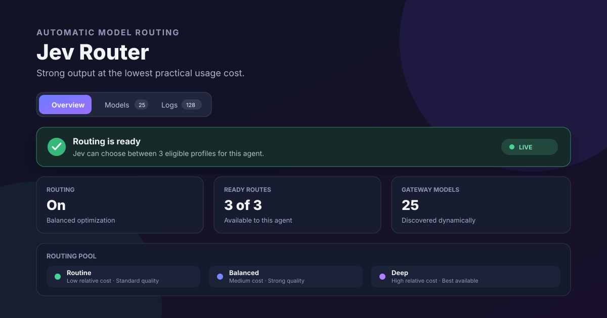

# Jev Router

OpenClaw **2026.9.5** feature plugin. Uses your existing TypeSafe/Jev (or OpenRouter)
credential to choose from an explicit, provider-neutral set of model profiles
with advisory thinking recommendations. Includes a native Control UI page and an
optional preview tool.



The default **Balanced** objective asks Jev to choose the lowest-relative-cost profile likely
to complete a task correctly in one pass. Administrators provide relative cost
and expected quality for their own models; the plugin does not hard-code providers,
model names, prices or subscription assumptions. These are routing heuristics, not
measured quality scores or a guarantee of savings.

Optional task continuity keeps the previous route for explicit short follow-ups
such as “continue” and “fix it”, avoiding another classifier call. The previous
run must have ended and its chosen model must have been observed. Routes expire
after two hours. Repeated distinct argument/structured-output failures in an
unsuccessful run can raise the next follow-up to the next available quality tier
on a different model. Network, permission, quota, unknown and recovered failures
do not trigger upgrades. Continuity is memory-only and stores no prompt text.

## Current support — read first

| Capability | Status |
|---|---|
| Jev model + thinking classification | Implemented, paired profile choice |
| Per-run provider/model override | Supported where before_model_resolve runs |
| Automatic thinking override | **Not supported by this host API; recommendation only** |
| Locked native Codex sessions | Host skips routing; never unlocked by this plugin |
| Actual model/thinking/token telemetry | Displayed only when reported by host |
| Subscription balance / exact cost | Not inferred; operator-supplied relative tiers |
| All providers | Explicit profiles; normal host auth and policy still apply |

This is NOT a universal automatic model-and-thinking switcher. Complete automatic
thinking requires a host-owned, per-run override API. We intentionally do not
patch installed OpenClaw files, spoof directives, mutate sessions from hooks,
replace provider credentials, or bypass native session locks.

The hook receives a prompt and attachment metadata, not full conversation history.
For contextual follow-ups, selection has less information than the answering agent.

## Use cases

### Keep routine work economical

A team has fast, standard and premium models on one Gateway. Jev Router sends
formatting, summaries and small edits to an approved lower-cost profile while
reserving stronger models for work likely to need them.

### Balance local and hosted models

A self-hosted Gateway exposes both local and cloud models. The operator describes
where each model performs well, sets relative cost and quality tiers, and lets the
router choose only among that allowlisted pool.

### Escalate difficult follow-ups safely

A coding task starts normally but produces repeated capability-related failures.
The next explicit follow-up can move up one configured quality tier, while network,
permission and quota failures do not cause an expensive escalation.

## Why not manual model selection?

Manual selection is simpler when every task uses one model. Jev Router is useful
when a shared Gateway has several approved models and operators want per-run
selection, conservative task continuity, readiness filtering and an auditable
decision history. It complements OpenClaw's host-owned fallback chain; it does not
replace provider authentication, retries or execution policy.

## Build and test

Node 22+ (tested Node 25), npm, OpenClaw 2026.9.5.

```sh
npm install --ignore-scripts
npm test
npm run build
npm run validate
openclaw plugins pack --root . --out ./jev-router.tgz --json
```

OpenClaw is pinned to the tested registry version, 2026.9.5. Use npm ci for
a clean dependency installation from the portable lockfile.
Runtime needs no new OpenAI API key.

## Installation and configuration

Install from ClawHub (recommended):

```sh
openclaw plugins install clawhub:openclaw-plugin-jev-router --accept-capabilities
```

Or install the exact GitHub release artifact:

```sh
curl -LO https://github.com/gowtham980/jev-router/releases/download/v0.4.4/jev-router-0.4.4-release.tgz
openclaw plugins install ./jev-router-0.4.4-release.tgz --accept-capabilities
```

Then grant the explicit conversation-hook permission, enable native UI for
user-installed plugins, and restart the Gateway:

```sh
# Required for non-bundled plugins to receive routing and usage hooks:
openclaw config set plugins.entries.jev-router.hooks.allowConversationAccess true
# Required for the Jev Router page to appear in Control UI:
openclaw config set gateway.controlUi.experimental.customPlugins true
openclaw gateway restart
```

Open **Jev Router** in Control UI to connect Jev and choose models discovered
from the selected agent's Gateway. Start in observe mode; route mode returns
per-run provider/model overrides.

Custom plugin UI is deliberately disabled by default on each Gateway. The
backend can be loaded while its page remains hidden until the setting above is
enabled. Open Control UI through HTTPS/Tailscale Serve or a browser-trusted
loopback URL such as `http://127.0.0.1:18789/`; authenticated native plugin UI
does not load over plain HTTP on a LAN address.

Conversation access is an explicit permission: it lets the plugin receive prompt-bearing hooks. The router forwards only its bounded, redacted prompt excerpt to Jev. Without this permission, previews can work while automatic routing hooks are blocked. Verify with `openclaw plugins inspect jev-router --runtime --json`: `before_model_resolve` must appear and diagnostics must not report blocked hooks.

The dashboard discovers the models shown by any compatible Gateway's normal model picker,
but the routing pool remains
an operator-managed allowlist. Administrators explicitly enable models and choose
routine, balanced or deep routing purposes, relative cost and expected output
quality. The optimization goal can be Quality, Balanced or Economy. Thinking is advisory. Host policy
is intersected with the saved profile list; no policy or credential settings are
broadened. The saved pool and optimization goal apply Gateway-wide, not only to
the selected agent. Eligibility is checked separately for every agent. The page
shows up to 500 catalog entries plus all saved profiles; unavailable and
duplicate-model profiles are preserved when saving. Identical cost/quality
estimates show guidance instead of implying meaningful cost differentiation.

Before classification, the router reads host auth state without refreshing or writing credentials. Profiles with no eligible stored credentials, provider/model cooldowns, disabled credentials, or quota blocks are excluded. Unknown readiness leaves the host selection unchanged; this is not an upstream health probe. Authless or external-only runtime routes are conservatively omitted unless represented by usable host profiles.

Each run is classified at most once. Subsequent retries/fallback attempts keep the host-selected candidate, preventing the hook from selecting the same failed model again. OpenClaw owns the configured fallback chain and execution policy.

Classifier failures retain the current model:
missing keys, service errors, low confidence, busy router, oversized responses,
and unsupported attachment types. Normal OpenClaw downstream auth/fallback
behavior remains unchanged. This plugin does not create API-key fallback.

## Dashboard

In the connected Gateway Control UI, enable **Settings → Labs → Custom plugin UI**
if not already enabled, then reload/restart as instructed by OpenClaw. Open
**Jev Router** in the sidebar. Use HTTPS or trusted localhost for native assets.

The page uses the existing authenticated host connection, not a new public HTTP
server. Snapshot reads require operator.read; previews require operator.write.
Credential and routing-pool changes require operator.admin. Updates use feature
events, with reconnect recovery and disposed subscriptions.

The dashboard separates Overview, Models and Logs into one-click tabs, surfaces
one actionable health state, keeps connected credential setup collapsed, and
provides model search and readiness filters. Unselected
models remain compact; selected profiles expose their purpose, cost, quality and
description controls. A sticky save bar keeps unsaved changes visible on large
catalogs, and decision history becomes a labeled card layout on narrow screens.

The Jev key form writes directly to OpenClaw's write-only team secret store with
egress restricted to Jev endpoints. Isolated plugin state contains only a
SecretRef. The key is never returned to the page after saving. Dashboard
preference changes do not rewrite Gateway configuration or reload providers.

Statuses distinguish preview/recommendation, override requested, observed model
match/mismatch, failure, and missing hook observation. Thinking is always labeled
recommended versus observed. An observed match is not proof the override caused
the selection. Records without a run ID cannot be reliably correlated.

The **Models Jev can choose from** section lists every configured profile and
shows its model, routing purpose, supported inputs, recommended thinking, current
relative cost, expected quality, eligibility for the selected agent, and the reason when it is excluded. This is
the exact configured choice pool; the plugin never selects an unlisted model.

## Privacy and reliability

- Resolves the dashboard-managed key from OpenClaw's secret store. Existing
  ~/.openclaw/credentials/typesafe_api_key and openrouter_api_key files remain
  supported for compatibility. Never prints or stores key values.
- Sends only the redacted, bounded prompt to the fixed Jev endpoint. No system
  prompt, history, tools, files, or attachments are forwarded.
- Redaction is best-effort, NOT a guarantee that arbitrary private data is removed.
  Routing through a cloud classifier discloses that prompt excerpt to its provider.
- 2.5s routing deadline including credential resolution (configurable); no retries; four concurrent requests;
  30s cooldown after rate limits/server errors; redirects prohibited.
- Responses bounded to 64KiB and choices checked against exact candidate labels.
- Latest 200 records are persisted through OpenClaw's native plugin state for
  trusted installs, or a mode-0600 journal for local/archive installs;
  no raw prompts, outputs, credentials, or session keys are stored. History can
  be cleared from the dashboard.
- Routing preferences use isolated plugin state (mode-0600 atomic JSON fallback
  for local/archive installs), so saving them cannot alter the Gateway model list.
- Dashboard uses textContent, not HTML from prompts or service responses.
- No OpenAI auth modifications, global default changes, core patches, or
  session mutations.

## Disable / rollback

```sh
openclaw plugins disable jev-router
```

Then follow the CLI's reload instructions. No model defaults need restoration.
Remove the plugin using the normal OpenClaw uninstaller if desired.

## 0.4.3 release status

The supported runtime is OpenClaw 2026.9.5. Release checks cover exact-profile
continuity, overlapping runs, lifecycle invalidation, conservative escalation,
deadline handling, persistence, dashboard preservation and host-policy enforcement.
Run `npm test`, `npm run build`, `npm run validate` and
`node scripts/dashboard-audit.mjs` before packing. See CHANGELOG.md and PRIVACY.md.
Licensed under MIT. Package publication remains
disabled (`private: true`); install the validated OpenClaw release artifact instead.

Start new deployments in observe mode, configure a small evaluated model pool,
and compare representative tasks before enabling routing. The plugin does not
benchmark answer quality, track subscription allowance, switch mid-run, or enforce
recommended thinking levels. Compatibility with other OpenClaw versions is not
claimed until verified.

OpenClaw artifact packing omits repository documentation. The GitHub release page
publishes the validated installable artifact alongside LICENSE, README.md,
PRIVACY.md, CHANGELOG.md and config.example.json in the source repository.

Known host limitation: OpenClaw 2026.9.5 native Codex conversations can
occasionally reject a model change while waiting for Codex to confirm unloading
the previous thread configuration. The host stops before inference and preserves
the conversation. This is an OpenClaw/Codex handoff limitation rather than a Jev
Router state mutation; reconnect and retry the turn.

## License

[MIT](LICENSE) — Copyright (c) 2026 Gowtham Krishna Teja Midde.

## Live model-only verification

See [MODEL_ROUTING_TEST.md](MODEL_ROUTING_TEST.md) for successful automatic model switches, required hook permission and reproduction commands.

## Fallback verification

See [FALLBACK_VERIFICATION.md](FALLBACK_VERIFICATION.md) for v0.1.2 changes, controlled fault-injection evidence, live OAuth checks, and limitations. Model fallbacks cannot recover an account-wide OpenAI auth/quota outage or a native runtime handoff failure.
